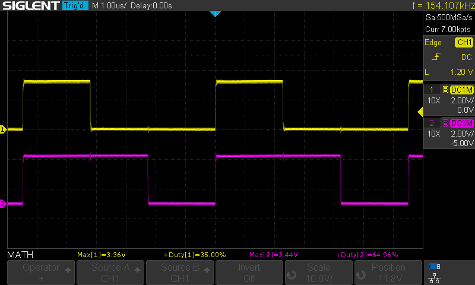

# PWM

PWM examples

### pwm1    
  
pwm output on GP16. The other output of the same PWM slice (GP17) is used as normal IO.  
trimmer on GP28 for adjusting duty cycle.  
oled display (128x32) on GP9=SCL and GP8=SDA

### pwm2
  
as pwm1 but both pwm outputs are used.  
Both Duty Cycles are adjusted with same trimmer on GP28 but in opposite way (if duty A is 20%, Duty B will be (100-20)=80% and so on.  

### pwm3
  
pwm outputs on GP16 and GP17.  
There are 2 trimmers on GP28 and GP27. Each trimmer adjusts a single channel Duty Cycle.  

### pwm150khz
  
Fixed 150kHz 50% Duty cycle on GP16 

### pwmop
  
150kHz PWM with inverted outputs on GP16 and GP17 

### pwmopt
Same as pwmop but using a trimmer on GP28 for adjusting the duty cycle

